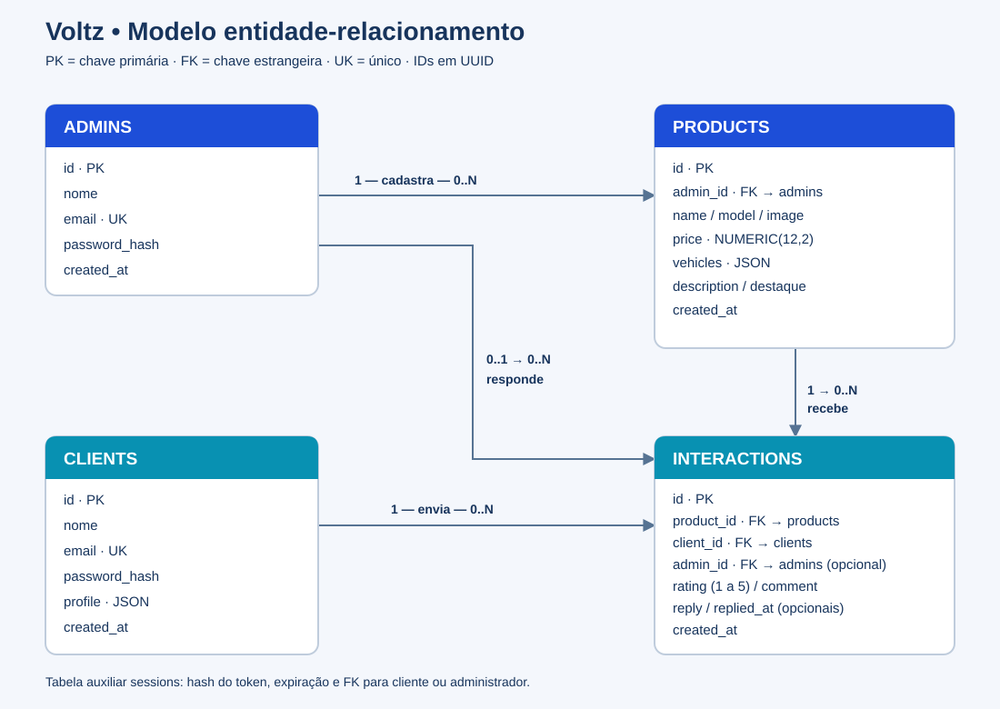
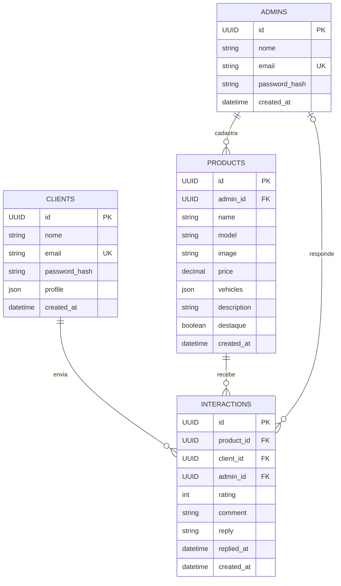

# Modelo entidade-relacionamento — Voltz

As quatro tabelas do domínio são `admins`, `clients`, `products` e `interactions`. A tabela `sessions` é auxiliar para autenticação. Os IDs do domínio são UUIDs gerados no backend. O esquema executável está em `server/schema.sql`.

- Um administrador cadastra zero ou muitos produtos; cada produto tem um administrador responsável.
- Um cliente envia zero ou muitas avaliações; cada avaliação pertence a um cliente e a um produto.
- Um produto recebe zero ou muitas avaliações. A nota deve estar entre 1 e 5.
- Uma avaliação pode ainda não ter resposta. Quando respondida, registra o administrador, a resposta e a data.
- A exclusão de produto remove suas avaliações, por chave estrangeira com `ON DELETE CASCADE`.
- E-mails são únicos em cada tipo de conta. Senhas são hashes scrypt com salt individual.
- `sessions` referencia exatamente um cliente ou um administrador, guarda apenas o hash do token e a expiração.

SQLite usa texto para UUID, datas e JSON; PostgreSQL usa o mesmo esquema portátil, com validação no backend e chaves estrangeiras no banco. No Supabase, as tabelas ficam no schema privado `voltz`, com RLS habilitado e acesso pela Data API bloqueado; o backend conecta pelo Session pooler. O preço usa `NUMERIC(12,2)`; o atributo destaque é 0/1 com uma restrição CHECK. Os testes executam os fluxos em SQLite e em PostgreSQL via PGlite, e `npm run db:check` verifica o banco real conectado.
